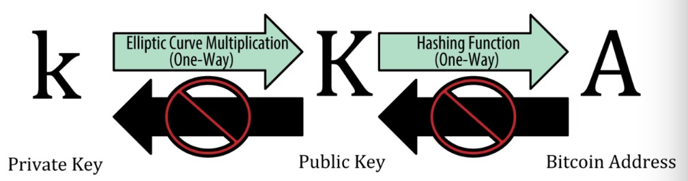

> 加密不是比特币的重要组成部分,因为它的通信跟交易数据没有加密,也不需要加密来保护资金

##### 简介

> 比特币所有权是通过数字密钥,比特币地址和数字签名来确定的,而数字密钥并不存储在网络中而是用户生成后存储在一个叫做钱包的文件中,此密钥完全独立于比特币协议
>
> 大多数交易都需要一个有效签名才会被存储在区块链中,只有有效的密钥才能产生有效的数字签名
>
> 密钥是成对出现的, 由一个私钥和一个公钥组成,比特币地址是用户经常看到的密钥的唯一代表,比特币使用的是非对称加密,使得任何人都可以验证每笔交易的每个签名,但确保只有私钥的所有者可以产生有效的签名 

###### 公钥加密和加加密货币

> 比特币是使用**椭圆曲线乘法**作为其公钥加密的基础 

###### 私钥跟公钥

> 密钥对包括一个私钥和一个公钥,私钥(K)是一个数字,通常是随机选出的,有了私钥可以单向加密产出一个公钥(K),有了公钥后可再单向生成一个比特币地址,三者之间关系如下图所示: 

##### Base58/Base58Check

> Base58是一种基于文本的二进制编码格式,是Base64的子集,去掉了(零(0),大写字母(O),(小写字母)l,(大写字母)I)跟"+","/"两个字符

