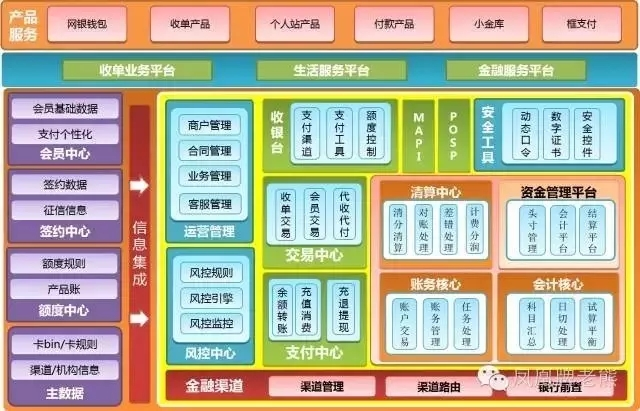

#### 支付

> 支付是交易的一部分 

#### 交易

> 支付是交易的一部分,一个简单的交易包括: 客户下单, 客户完成支付, 商家收单, 商家出货 

###### 正常流程

* 对订单进行检验,无问题则调起支付接口执行支付(服务端发起,并做接口签名)
* 支付系统检查参数有效性,特别是签名的有效性 
* 根据用户选择的支付方式及系统的支付路由设置,选择合适的收单机构 

###### 账务信息

> * 交易需求,检查账户是否被锁定,余额是否足够,有效等
> * 记账需求,按照公司会计需求记录账户的所有行为,包括支出,充值,转账等 
> * 对账需求,包括和支付渠道,商户,个人的对账,核对交易和账户余额是否正确
> * 风控需求,
> * 信用需求,对用户资产,商户等主体进行信用评估时

* 支付账户
* 登录账户

###### 业界架构图

* 京东金融

  

