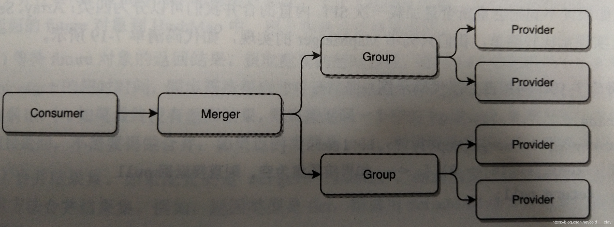

> 实现了面向接口代理的RPC调用，服务注册和发现，负载均衡，容错，扩展性等功能 
>

#### 分层机制

- 业务层
- RPC层
  - Config
  - Proxy
  - Registry
  - Cluster
  - Monitor
  - Protocol
- Remoting层
  - Exchange
  - Transport
  - Serialize


#### 工作机制


##### 服务暴露

ServiceBean

ServiceConfig -> ProxyFactory -> Invoker -> Protocol -> Exporter 

##### 服务消费

ReferenceBean

ReferenceConfig -> Protocol -> Invoker -> ProxyFactory -> Ref 

调用时会检测是否同一个 JVM 内部调用 

##### 容错机制


通过在 Cluster 属性上进行设置：

- Failover，出现失败立即重试其它服务器，可设置重试次数
- Failfast，请求失败后返回异常结果不重试
- Failsafe，出现异常直接忽略 
- Failback，请求失败后将失败记录放到失败队列中，通过定时线程扫描该队列，并定时重试
- Forking，尝试调用多个相同服务，其中任意一个服务返回就立即返回结果 
- Broadcast，广播调用所有可连接的服务，任一个返回错误就任务调用失败
- Mock，响应失败时返回伪造的响应结果
- Available，通过遍历的方式查找所有服务列表，找到第一个可以返回结果的节点，并且返回结果

##### 负载策略

- Random LoadBalance，随机可设置权重
- RoundRobin LoadBalance，轮询，按照公约后权重设置轮询比例
- Least Active LoadBalance，按照活跃数调用，活跃度差的被调用的次数多。活跃度相同的进行随机
- Consistent Hash LoadBalance，一致性 Hash，相同参数的请求总是发到同一个提供者

##### 过滤器

过滤器之间有先后顺序。因此在设计上采用了装饰器模式，将 Invoker 进行层层包装，每包装一层就加入一层过滤条件。在执行过滤器的时候就好像拆开一个一个包装一样。

##### 编码器

- ExchangeCodec

##### SPI 

##### Merger

当一个接口有多种实现，消费者又需要同时引用不同的实现时，可用 group 来进行区分。

``` xml
<dubbo:service group="group1" interface="com.xxx.***"/>
<dubbo:service group="group2" interface="com.xxx.***"/>
```

但是如果我们需要并行调用不同group的服务，而且需要把结果集合并的时候，则需要用到 Merger 特性



