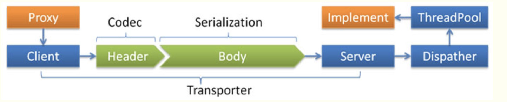

#### Dispather

- all 所有消息都派发到线程池，包括请求，响应，连接事件，断开事件，心跳等。
- direct 所有消息都不派发到线程池，全部在IO线程上直接执行。
- message 只有请求响应消息派发到线程池，其它连接断开事件，心跳等消息，直接在IO线程上执行。
- execution 只请求消息派发到线程池，不含响应，响应和其它连接断开事件，心跳等消息，直接在IO线程上执行。
- connection 在IO线程上，将连接断开事件放入队列，有序逐个执行，其它消息派发到线程池。

#### ThreadPool

- fixed 固定大小线程池，启动时建立线程，不关闭，一直持有。(缺省)
- cached 缓存线程池，空闲一分钟自动删除，需要时重建。
- limited 可伸缩线程池，但池中的线程数只会增长不会收缩。(为避免收缩时突然来了大流量引起的性能问题)。

#### Config

``` xml
<dubbo:protocol name="dubbo" dispatcher="all" threadpool="fixed" threads="100" />
```

