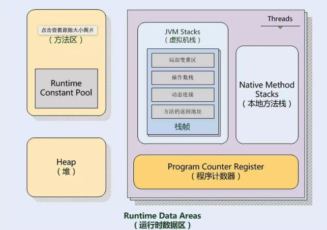
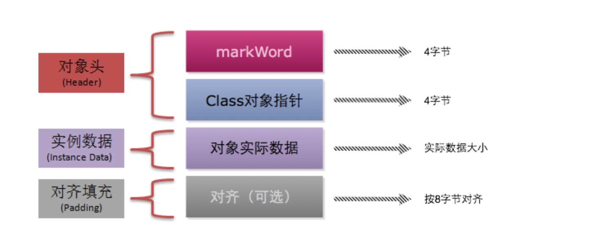

#### CPU 层面

- 内存屏障，硬件层面保障 

  > CPU 指令可能是无序的，故屏障有两个作用，1是阻止屏障两侧指令重排，2是强制把写缓冲区/高速缓冲区中的数据写回主内存，让缓存失效。

  - Load Barrier 读屏障
  - Store Barrier 写屏障 

- volatile 型变量

  > 用此修饰的关键字有线程可见性，就是通过在其读写前后添加内存屏障来实现。

#### Java Memory Model

> JMM 是 JVM 的一种规范，定义了 JVM 的内存模型，屏蔽了各种硬件跟操作系统的访问差异，主要目的是解决由于多线程通过共享内存进行通信时，存在的本地内存不一致，编译器会对代码进行重排，处理器会对代码乱序执行等带来的问题，可保证并发场景中的原子性，可见性跟有序性。

#### 五大存储区域

###### 线程私有

- 程序计数器

  > 很小的一块区域，是当前线程的行号指示器，是内存区域中唯一一块没有 OutOfMemoryError 的区域

- 虚拟机栈

  - 线程请求栈深度大于虚拟机允许的栈深度，抛出 StackOverflowError
  - 虚拟机栈空间可动态扩展，当无法申请后会抛出 OutOfMemory 异常

- 本地方法栈

###### 线程共享

> 理论上所有对象实例跟数组都在这个区中分配内存，但随着 JIT 编译器的发展跟逃逸分析技术的成熟，这说法也就成为了理论上，但大多数情况下还是这样的。

- 堆

- 方法区 

  > 用于存储已被虚拟机加载的类信息，常量，静态变量等，在老一代jdk版本中也有叫永久代的，不过在jdk8中已被废弃，改为使用元空间，Metaspace。

#### 内存布局

- 对象头
  - 锁标识
- 实例数据
- 对齐填充 

#### 重排序

- as-if-serial 

  > 所有动作都可以为了优化而被重排，但须保证重排后结果不变

- happens-before 

  > 传递性：如果 A hb B，而 B hb C，那么 A happens-before C
  >
  > Volatile 变量规则：对一个volatile域的写，happens- before 于任意后续对这个volatile域的读
  >
  > 监视器锁规则：对一个监视器锁的解锁，happens- before 于随后对这个监视器锁的加锁。

#### 同步消除

#### 标量替换 

#### 其它 

