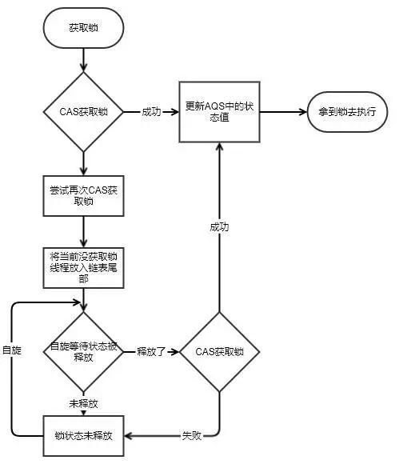
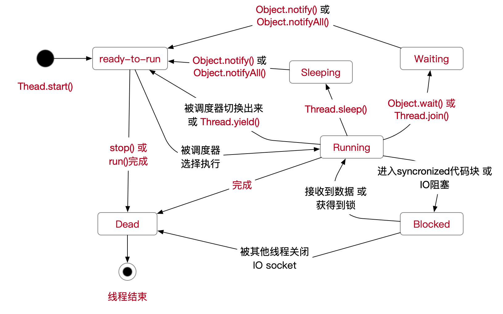

#### 多线程

- 有序性
- 可见性
- 原子性

#### synchronized

> 基于 Monitor 实现，Monitor 是基于 C++实现，由 ObjectMonitor 实现，意味着一次内核态的切换

- 同步方法
  - ACC_SYNCHRONIZED
- 同步代码码
  - monitorenter
  - monitorexit

#### collecitons

- Queue
  - ConcurrentLinkedQueue
  - BlockingQueue
    - ArrayBlockingQueue
    - DelayQueue
    - LinkedBlockingQueue
    - PriorityBlockingQueue
    - SynchronousQueue
  - Deque
    - ArrayDeque
    - InentityLinkedList
    - LinkedList
    - BlockingDeque
      - LinkedBlockingDeque
- CopyOnWriteArrayList
- CopyOnWriteArrsySet
- ConcurrentSkipListSet
- ConcurrentMap 
  - ConcurrentHashMap
  - ConcurrentNavigableMap
    - ConcurrentSkipListMap 

#### executor

- Future
  - RunnableFuture
    - RunnableScheduledFuture
    - FutureTask
  - ScheduledFuture
- Callable
- Executor
  - ExecutorService 
    - ScheduledExecutorService
    - ThreadPoolExecutor
    - ScheduledThreadPoolExecutor
- CompletionService
  - ExecutorCompletionService
- RejectedExecutionhandler
  - DiscardPolicy
  - DiscardOldestPolicy
  - CallerRunsPolicy
  - AbortPolicy
- TimeUnit

#### tools

- CountDownLatch
- CyclicBarrier
- Semaphore
- Executors
- Exchanger

#### locks

- Lock

  - ReentrantLock，通过构造传参确定是否是公平锁
    - ReadLock
    - WriteLock

- Condition

- ReadWriteLock

  - ReentrantReadWriteLock

- LockSupport

- AbstractQueuedSynchronizer

  - 双向链表

  - 类型状态

    

#### aotmic

- AtomicBoolean
- AtomicInteger
- AtomicIntegerArrray
- AtomicLong
- AtomicLongArray
- AtomicReference 

### 多线程同步

> Object.wait，释放CPU资源，同时释放锁，可中断方法，被中断后抛出异常
>
> Thread.sleep，释放CPU资源，但不释放锁，当前线程，可中断方法，被中断后抛出异常
>
> Thread.join
>
> Thread.yield，释放CPU的执行权，但依然保留执行资格。举个例子：很多人排队上厕所，刚好排上yield了，但yield说，出让这次机会，与更急的人一起比赛谁能更快进入厕所。这个比赛结果可能是其他人也可能就是yield本身，也是当前线程
>
> LockSupport.park

####InterruptedException

> 当阻塞方法收到中断请求的时候就会抛出此异常

#### 线程状态 

- New 这个状态主要是线程未被Thread.start()调用前的状态
- Runnable，线程正在 JVM 中运行
- Blocked，被阻塞等待一个 monitor 锁
- Waiting，由于调用了 Object.wait(0)/Thread.join(0)/LockSupport.park 的线程状态 
- Timed_Waiting，调用了 Object.wait(long)/Thread.join(long)/LockSupport.parkNanos/LockSupport.parkUntil 的线程状态 
- Terminated，线程终止 

