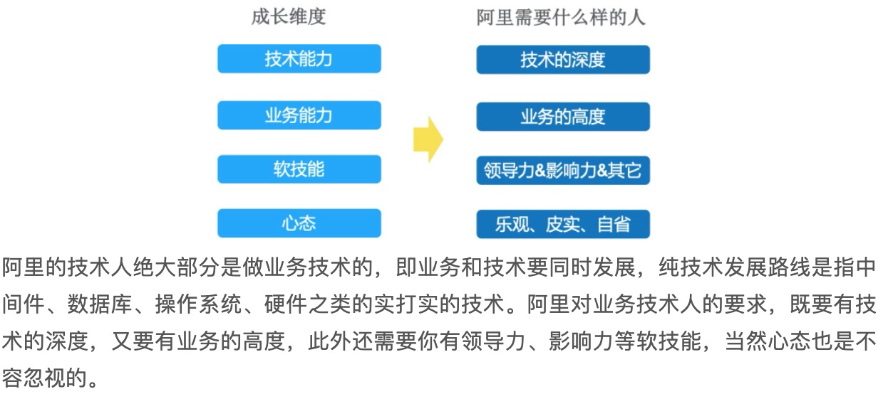
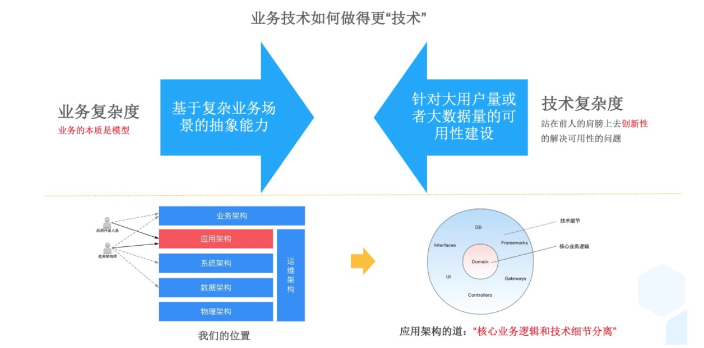
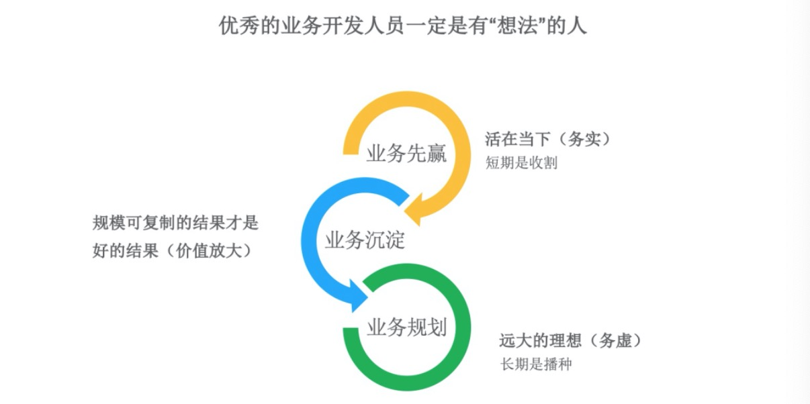
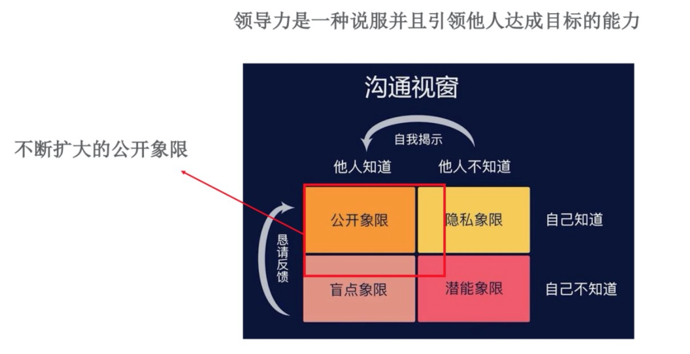
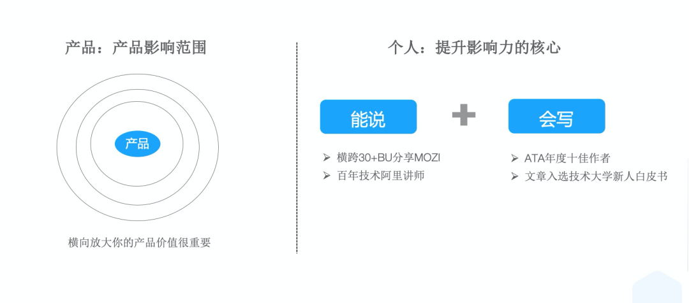
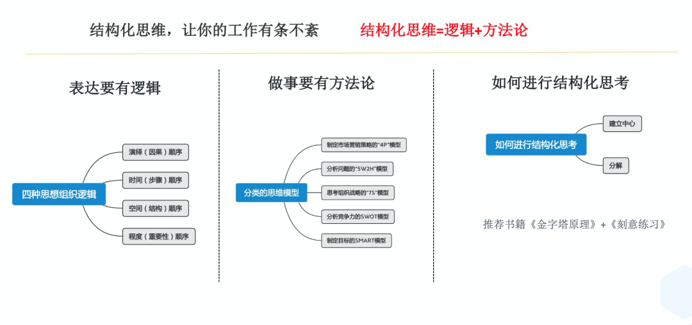
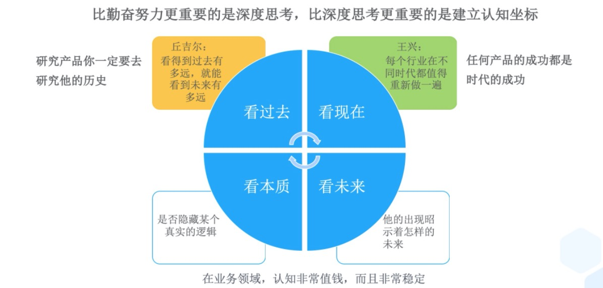
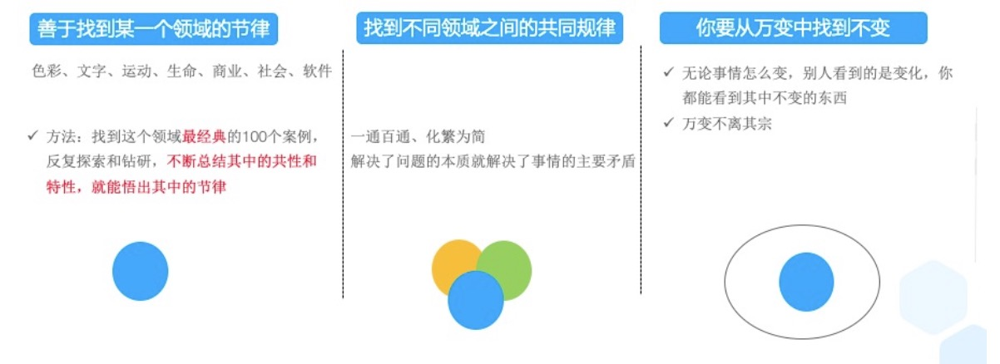
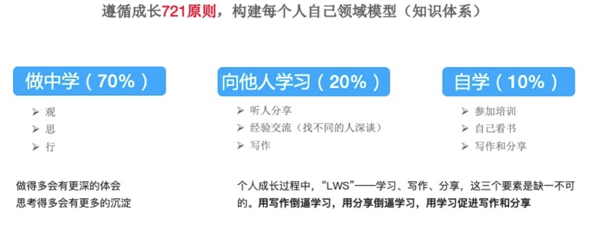

#### 成长的维度

#### 技术的深度

- 业务复杂度，"基于复杂业务抽象的场景能力"是一种能体现你技术深度的能力，业务的本质是模型，如果我们能基于复杂业务场景抽象出领域模型或者基于复杂业务场景做流程编排，做好分层，不仅反映你对业务认知的深度，也反映了你的技术深度。

- 技术复杂度，"核心业务逻辑和技术细节分离"

  

#### 业务的高度

- 要结合自己当前的业务，不能脱离现状谈规划
- 要去参考你行业的标杆，借鉴别人的成功理念，然后融入到自己的业务场景中

#### 软技能

- 影响他人的能力

  - 领导力，一种说服并且引领他人达成目标的能力 
    - 心力：其实是让大家对某件事情内心达成一至
    - 脑力：对事情的深度思考 
    - 体力：引领大家把事情做好，拿到结果

  

    

- 强化自己的能力

  - 结构化思维

    

  - 抽象力

    > 万物皆抽象，抽象能力让你可以化繁为简，从而抓住事物本质。
    >
    > - 通过对比寻找共性，把共性提炼出来
    > - 如果没共性，就提升抽象层次，比如植物跟动物上升就是生物
    > - 最终构建一个金字塔，参考《金字塔原理》

- 构建认知坐标

  

- 一眼看穿本质的能力 

  

#### 成长方法论

