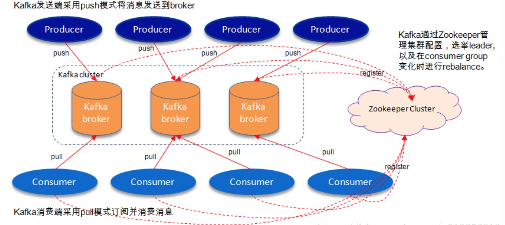

#### 体系结构



#### 术语

* Broker 处理节点, 多个broker组成一个kafka集群

* Topic 一类消息主题

* Partition topic的物理分组,每个partition是个有序队列 

* Segment  partition的物理分组,由 *.index跟 *.log两个文件组成 

* Producer

* Consumer

* ConsumerGroup

* HW

  > HighWatermark的缩写,指consumer能够看到的此partition的位置 

* LEO 

  > LogEndOffset的缩写,表示每个partition的log最后一条Message的位置 

* ISR 

  > In-Sync Replicas, 副本同步队列, 所有副本统称为**Assigned Replicas**,即**AR**,**ISR**是其的一个字集

#### 水平扩展

> 每一条消息被发送到broker中,会根据partition规则选择被存储到哪一个partition.如果partition规则设置的合理,所有消息可以均匀分布到不同的partition里,这样就实现了水平扩展

#### Leader 选举

> Kafka在Zookeeper中为每一个partition动态的维护了一个ISR，这个ISR里的所有replica都跟上了leader，只有ISR里的成员才能有被选为leader的可能（unclean.leader.election.enable=false）。在这种模式下，对于f+1个副本，一个Kafka topic能在保证不丢失已经commit消息的前提下容忍f个副本的失败，在大多数使用场景下，这种模式是十分有利的。事实上，为了容忍f个副本的失败，“少数服从多数”的方式和ISR在commit前需要等待的副本的数量是一样的，但是ISR需要的总的副本的个数几乎是“少数服从多数”的方式的一半。

#### 消息保障

> 业务消息本身具备幂等性来进行去重 

* at least once
* at most once 
* exactly once 

#### 配置

```
num.partitions=3  // topic默认的partition数量 
default.replication.refactor=3 // partition的副本个数
log.segment.bytes // segment的文件生命周期
request.required.acks //设置数据可靠性级别,1默认,0效率最高但可靠性最低相当于只管发不确认,-1可靠性最高但效率低需要所有ISR确认,如果此时ISR只有leader一个时,相当于退化成默认值1的情况
min.insync.replicas // 配合上面的参数值是-1的情况此参数才起作用
producer.type=(a)sync // 发送是异步还是同步
queue.buffering.max.ms // 发送异步时,会缓存多久的数据再一次性发送出去,增加吞吐量但会降低时效性
queue.buffering.max.message // 发送异步时,缓存队列最大缓存消息数量如超过,则会阻塞或丢弃
queue.enqueue.timeout.ms // -1为默认则阻塞,如果为0则丢弃,配合上一个参数
batch.num.messages // 异步时每次批量发送的数量 
```
