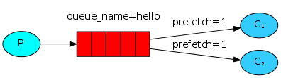
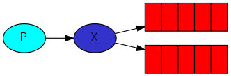
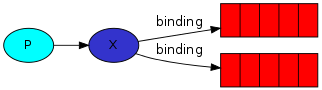

##### 术语 

* ConnectionFactory/Connection

* Channel

  > 信道,复用TCP连接,与RabbitMQ打交道最重要的一个接口,定义Queue,Exchange都是在这完成 

* Queue

  > RabbitMQ的内部对象, 消息队列 

* Message Acknowledgment

* Message Durability 

* Prefetch count

  

  > 设置值为1,则Queue每次给消费者发送一条消息,等其处理完再发下一条,这样每个consumer在同一个时间点最多处理一个Message,换句话说,在接收到该consumer的ack前,它将不会再接收到新的message

* Exchange 

  

  > 生产者将消息实际上发送到exchange(交换机),由它来将其路由到queue中(或丢弃),怎么路由呢, 根据Binding进行路由

  * fanout, 进行广播,将所有message都放到它所知道的queue中
  * direct, 根据 routing key 进行匹配传递到相应的queue, 需要完全匹配 routing key 
  * topic, 对key进行模式匹配,如ab*将会被传递到abc,abd,abef等所有匹配成功的queue中,有通配符
  * headers, 根据header的arguments参数进行路由

* Routing Key

  > Exchange Type/Binding Key固定下, 发送到Queue, 长度限制为255Bytes

* Binding / Binding Key

  

  > 绑定用于消息队列跟交换器之间的关联

##### 消息发布与消费权衡

##### 消息拒绝怎么解决

##### 控制队列与消息属性

