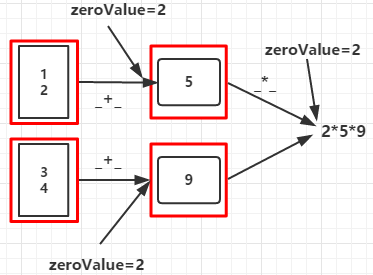

#### Action

>触发Spark作业的运行, 真正触发算子的转换 

* reduce(func)

  > func接收两个参数,返回一个新值,新值再作为参数继续传递给func,直到最后一个元素

* collect()

  > 以数据形式返回数据集中所有元素给Driver,为防止Driver内存溢出,一般要控制返回数据集大小

* countByKey()

  > 作用于K-V类型的RDD,统计每个K的个数,返回(K,K的个数)

* collectAsMap()

  > 作用于K-V类型的RDD,与collect不同的是此函数不包含重复的K,对于重复的K后面的会覆盖掉前面的

* lookup(K)

  > 作用于K-V类型的RDD,返回指定K的所有V值 

* aggregate(zeroValue:U)(seqOp:(U,T)=>U,comOp(U,U)=>U)

  > seqOp函数将每个分区的数据聚合成类型为U的值,comOp函数将各分区的U类型数据聚合起来得到类型为U的值

  ```
  val rdd = sc.parallelize(List(1,2,3,4),2)
  val aggregateRDD = rdd.aggregate(2)(_+_,_ * _)
  println(aggregateRDD) // 90
  ```

  * 分区1: zeroValue + 1 + 2 = 5  分区2: zeroValue + 3 + 4 = 9
  * zeroValue * 分区1结果 * 分区2结果 

  

* fold(zeroValue:T)(op:(T,T)=>T)

  > 相当于seqOp跟comOp函数都相同的aggregate函数 

